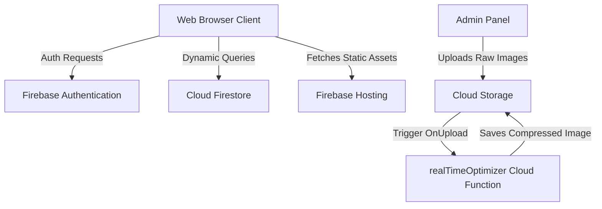

# Safari Operations — Administration Portal & Web App

[-orange?style=flat-square)](#)
[](#)
[](#)
[](#)
[](#licence)

A premium, serverless web application and administration suite designed for a luxury Zimbabwe-based safari operation, developed and owned by **AilseeCodes**. The system manages safari tour information, operational schedules, gallery assets, and client testimonials dynamically from a secure dashboard.

---

## 🌟 Key Features

### 1. Unified Administration Suite (`admin.html`)
* **Safari Management**: Real-time CRUD operations for safari itineraries, activities, locations, and cover images.
* **Acknowledgements System**: A single, central field to manage website photography and typography credits dynamically across the application.
* **Park & Wildlife Logs**: Live logs tracking current park status, safari operations, and guides.
* **Secure Access**: Protected by Firebase Authentication (restricted access).

### 2. High-Performance Client Web App
* **Interactive Itineraries (`safaris.html`)**: Beautifully responsive pages loading details dynamically from Cloud Firestore.
* **Wildlife Gallery (`gallery.html`)**: Rich visual gallery optimised for rapid page loading and smooth media preview transitions.
* **Safari Details (`collection.html`)**: Focus pages displaying details, testimonials, maps, and specific safari features.
* **Custom User Experience**: Customised interactive elements, including micro-animations, a custom animal cursor, audio snippet players, and dynamic sliders.

### 3. Serverless Cloud Operations
* **Automated Image Optimisation Cloud Function (`realTimeOptimizer`)**: A Firebase Cloud Function trigger that executes on Google Cloud Storage uploads. It automatically strips EXIF metadata, strips embedded profiles, compresses images (JPEG/WebP), and saves substantial bandwidth.
* **Dynamic Search & Social Pre-views**: Custom OpenGraph metadata with WhatsApp preview pre-warming logic.
* **Favicon Clamping**: Optimised high-resolution favicons with color smearing algorithms to render beautifully in both Google Search results and modern web browsers.

---

## 🛠️ Architecture & Tech Stack



* **Frontend**: Semantic HTML5, Modular CSS3 (Vanilla design tokens, transitions, custom properties), Vanilla JavaScript (ES6+ async/await, Real-time Firestore Listeners).
* **Database**: Cloud Firestore (Structured collections: `site_settings`, `safaris`, `gallery`).
* **Storage**: Firebase Cloud Storage (Optimised for rich imagery).
* **Serverless Backend**: Node.js Firebase Cloud Functions (incorporating automated optimisation tools).
* **Security Rules**: Robust Firebase Security Rules protecting Firestore collections and Storage paths.

---

## 🚀 Setup & Local Execution

Follow these steps to run the application locally or deploy it to your own Firebase project:

### Prerequisites
* [Node.js](https://nodejs.org/) (v18 or higher recommended)
* [Firebase CLI](https://firebase.google.com/docs/cli) (`npm install -g firebase-tools`)

### 1. Clone & Install Dependencies
```bash
git clone https://github.com/AilseeCodes/safari-operations-portal.git
cd safari-operations-portal

# Install Cloud Functions dependencies
cd functions
npm install
cd ..
```

### 2. Configure Firebase Local Emulators
Initialize the Firebase configuration to point to your project:
```bash
firebase use --add
```
Set up local environment emulation to safely run Firestore, Functions, and Hosting:
```bash
firebase emulators:start
```
Once running, open the local instance at [http://localhost:5000](http://localhost:5000) or check the Emulator Suite UI at [http://localhost:4000](http://localhost:4000).

### 3. Deployment
To push rules, hosting files, database indexes, and cloud functions to your live Firebase environment:
```bash
firebase deploy
```

---

## 📄 Licence

This codebase is proprietary. Permission is granted solely to download, inspect, and execute the project locally for portfolio review and recruitment evaluation purposes. Re-hosting, modification, replication, or commercial redistribution of any visual or functional asset is strictly prohibited. See the [LICENCE](LICENSE) file for more information.
